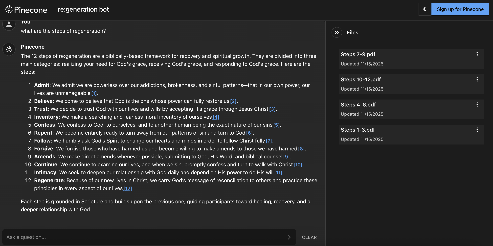

# Pinecone Assistant 1-Click Deploy

Deploy a Pinecone Assistant chat interface to Render with one click.

### 🎨 Features

- 🚀 **Super Simple** - Deploy your Pinecone Assistant to Render with one click
- 💬 **Streaming Chat** - Real-time streaming responses from your Assistant
- 📁 **Files Panel** - View all files uploaded to your assistant
- 📱 **Responsive** - Works on all devices

## 🚀 Deploy to Render

[](https://render.com/deploy?repo=https%3A%2F%2Fgithub.com%2Faaronkao%2Fpinecone-assistant-render-1-click-deploy)



## Deployment Steps

1. **Click the "Deploy" button above**
   - You'll be redirected to Render's deployment page
   - If you're not logged in, sign in with GitHub

2. **Configure your repository and set environment variables**
   - Render will automatically detect this repository
   - Connect your GitHub account if not already connected
   - Select this repository from the list
   - Choose a name for your web service
   - Select the region closest to your users
   - Choose a plan (Free tier available for testing)
   - Add your environment variables in the Environment Variables section:
   **Required:**
     - `PINECONE_API_KEY` - Your Pinecone API key
     - `PINECONE_ASSISTANT_NAME` - Your Pinecone Assistant name
     - `NEXT_PUBLIC_ASSISTANT_NAME` - The name you want to be displayed for your assistant
     - `NEXT_PUBLIC_WELCOME_MESSAGE` - Your custom welcome message
   **Optional (set after initial deploy and redeploy):**
     - `MODEL` - The model to use for chat responses. Options: `gpt-4o` (default), `gpt-4.1`, `o4-mini`, `claude-3-5-sonnet`, `claude-3-7-sonnet`, `gemini-2.5-pro`
     - `NEXT_PUBLIC_HIDE_FILES` - Set to `true` to hide the files drawer panel completely (both desktop and mobile). Default: `false`
   - Click the "Create Web Service" button

3. **Your chat interface will be live!**
   - Once deployment completes, your chat interface will be ready to use

### 📋 Getting Your Pinecone Credentials

Before deploying, make sure you have:

1. **Pinecone API Key**
   - Visit [Pinecone Console](https://app.pinecone.io)
   - Go to **API Keys** section
   - Copy your API key

2. **Pinecone Assistant Name**
   - Visit [Pinecone Console](https://app.pinecone.io)
   - Go to **Assistants** section
   - Create a new assistant or select an existing one
   - Copy the Assistant name (this is the identifier you'll use)

### 📤 Upload Files to Your Assistant

Populate your Assistant's knowledge base with files

   - Visit [Pinecone Console](https://app.pinecone.io)
   - Go to **Assistants** section
   - Select your assistant
   - Click on the **Files** tab
   - Click **Upload File** button
   - Select the file(s) you want to upload (supports PDF, TXT, MD, and other text-based formats)
   - Files will be processed and indexed automatically
   - Once uploaded, files will be available for your assistant to reference in conversations
   - You can view, download, or delete files from the Files panel in your deployed chat interface

### 🔧 Local Preview (Optional)

If you want to preview the app locally before deploying:

1. **Clone this repository:**
   ```bash
   git clone https://github.com/pinecone-io/pinecone-assistant-render-1-click-deploy.git
   cd pinecone-assistant-render-1-click-deploy
   ```

2. **Create `.env` file:**
   ```bash
   cp example.env .env
   ```

3. **Edit `.env` with your credentials:**
   ```env
   PINECONE_API_KEY=your-api-key-here
   PINECONE_ASSISTANT_NAME=your-assistant-name-here
   NEXT_PUBLIC_ASSISTANT_NAME=your-assistant-name-here
   NEXT_PUBLIC_WELCOME_MESSAGE=Your custom welcome message here
   # Optional
   MODEL=gpt-4o
   NEXT_PUBLIC_HIDE_FILES=false
   ```

4. **Install dependencies and run:**
   ```bash
   npm install
   npm run dev
   ```

5. **Open [http://localhost:3000](http://localhost:3000)** to see the app

## 📚 Resources

- [Pinecone Assistant Docs](https://docs.pinecone.io/guides/assistant/)
- [Render Deployment Docs](https://render.com/docs)
- [Next.js Documentation](https://nextjs.org/docs)

## 📝 License

MIT

